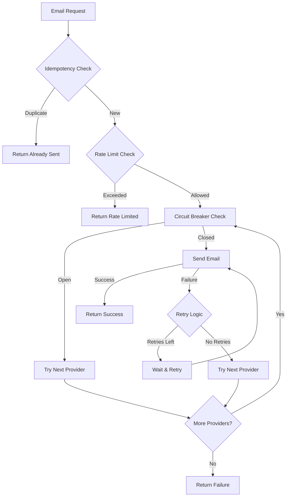

# 🚀 Resilient Email Service

<div align="center">


**Enterprise-grade email service with built-in resilience patterns**

[Features](#-features) • [Quick Start](#-quick-start) • [Documentation](#-documentation) • [Examples](#-examples)

</div>

---

## 🎯 What is this?

A **production-ready Node.js email service** that handles the complexities of email delivery with enterprise-grade reliability. Instead of worrying about retries, failures, and rate limits, you get a simple API that just works.

### 🏗️ Built for Production

- **🔒 Zero Downtime** - Automatic failover between providers
- **⚡ High Performance** - Optimized for high-volume sending
- **🛡️ Bulletproof** - Circuit breakers prevent cascading failures
- **📊 Observable** - Comprehensive monitoring and logging

---

## ✨ Features

| Feature | Description | Benefit |
|---------|-------------|---------|
| 🔄 **Multi-Provider** | Automatic fallback between email providers | Never lose emails due to provider outages |
| ⚡ **Circuit Breaker** | Prevents cascading failures | Protects your system from external failures |
| ⏱️ **Rate Limiting** | Configurable request throttling | Respect provider limits and avoid blocks |
| 🔄 **Smart Retries** | Exponential backoff with configurable attempts | Maximize delivery success |
| 🆔 **Idempotency** | Prevents duplicate sends | Guarantees exactly-once delivery |
| 📧 **Email Queue** | Async processing with priority support | Handle high-volume sending efficiently |
| 📊 **Status Tracking** | Monitor every email's journey | Complete visibility into delivery status |
| 📝 **Structured Logging** | Debug and monitor with ease | Production-ready observability |

---

## 🚀 Quick Start

### Installation

```bash
npm install resilient-email-service
```

### Basic Usage

```javascript
import EmailService from 'resilient-email-service';

// Create service instance
const emailService = new EmailService();

// Send an email (that's it!)
const result = await emailService.sendEmail({
  to: 'user@example.com',
  subject: 'Welcome!',
  body: 'Thanks for signing up!'
});

if (result.success) {
  console.log('✅ Email sent!');
  console.log(`Provider: ${result.provider}`);
  console.log(`Message ID: ${result.messageId}`);
} else {
  console.log('❌ Failed:', result.message);
}
```

### Advanced Usage

```javascript
import EmailService, { configs } from 'resilient-email-service';

// Use production-ready configuration
const emailService = new EmailService(configs.production);

// Queue emails for batch processing
await emailService.queueEmail({
  to: 'user@example.com',
  subject: 'Newsletter',
  body: 'Monthly updates...'
});

// Process all queued emails
await emailService.processQueue();

// Monitor service health
const health = emailService.getServiceHealth();
console.log('Service Status:', health);
```

---

## 📚 Documentation

### Configuration Options

```javascript
const emailService = new EmailService({
  maxRetries: 3,           // Retry attempts per provider
  initialRetryDelay: 1000, // Initial delay in ms
  maxRetryDelay: 30000     // Maximum delay in ms
});
```

### Pre-built Configurations

```javascript
import { configs } from 'resilient-email-service';

// Development - Fast retries for testing
const devService = new EmailService(configs.development);

// Production - Conservative settings
const prodService = new EmailService(configs.production);

// High Volume - Optimized for throughput
const highVolService = new EmailService(configs.highVolume);
```

### API Reference

#### Core Methods

| Method | Description | Returns |
|--------|-------------|---------|
| `sendEmail(emailData)` | Send email with full resilience | `Promise<Result>` |
| `queueEmail(emailData, priority)` | Add to processing queue | `Promise<string>` |
| `processQueue()` | Process all queued emails | `Promise<void>` |
| `getEmailStatus(emailId)` | Get specific email status | `Object` |
| `getServiceHealth()` | Get comprehensive health info | `Object` |

#### Email Data Format

```javascript
{
  to: 'recipient@example.com',     // Required
  subject: 'Email Subject',        // Required
  body: 'Email content...',        // Required
  id: 'custom-id'                  // Optional (for idempotency)
}
```

#### Result Format

```javascript
{
  success: true,                    // Boolean
  emailId: 'abc123',               // String
  status: 'sent',                  // String
  provider: 'Provider1',           // String
  messageId: 'msg-123',            // String
  message: 'Success message',      // String
  timestamp: '2024-01-01T00:00:00Z' // String
}
```

---

## 🧪 Examples

### Available Examples

The project includes several example files demonstrating different aspects of the service:

| Example | Description | What it Shows |
|---------|-------------|---------------|
| `basic` | Simple email sending | Basic API usage and successful delivery |
| `advanced` | Resilience patterns | Circuit breakers, rate limiting, and failure handling |
| `success` | High-volume sending | Increased rate limits and batch processing |

```bash
# Basic usage - Simple email sending
npm run example:basic

# Advanced features - Resilience patterns in action
npm run example:advanced

# Success demonstration - High-volume sending with increased limits
npm run example:success
```

### Basic Email Sending

```javascript
import EmailService from 'resilient-email-service';

const emailService = new EmailService();

const result = await emailService.sendEmail({
  to: 'user@example.com',
  subject: 'Welcome!',
  body: 'Thank you for joining us!'
});

console.log(result.success ? '✅ Sent!' : '❌ Failed');
```

### High-Volume Success Demo

```javascript
import EmailService from 'resilient-email-service';

const emailService = new EmailService();

// Increase rate limiter for higher throughput
emailService.rateLimiter.configure(7, 5000); // 7 emails per 5 seconds

const emails = [
  { to: 'user1@example.com', subject: 'Welcome!', body: 'Welcome to our platform!' },
  { to: 'user2@example.com', subject: 'Account Created', body: 'Your account has been created.' },
  { to: 'user3@example.com', subject: 'Order Confirmation', body: 'Thank you for your order!' },
  // ... more emails
];

// Send multiple emails successfully
for (const email of emails) {
  const result = await emailService.sendEmail(email);
  if (result.success) {
    console.log(`✅ Email sent to ${email.to}`);
  }
}
```

### Batch Processing

```javascript
const emails = [
  { to: 'user1@example.com', subject: 'News #1', body: 'Content...' },
  { to: 'user2@example.com', subject: 'News #2', body: 'Content...' },
  { to: 'user3@example.com', subject: 'News #3', body: 'Content...' }
];

// Queue all emails
for (const email of emails) {
  await emailService.queueEmail(email);
}

// Process them all
await emailService.processQueue();
```

### Monitoring & Health Checks

```javascript
// Get service health
const health = emailService.getServiceHealth();

console.log('📊 Service Health Report:');
console.log(`📧 Total Emails Sent: ${health.totalEmailsSent}`);
console.log(`📋 Total Emails Tracked: ${health.totalEmailsTracked}`);
console.log(`📬 Queue Size: ${health.queue.size}`);

// Provider status
health.providers.forEach(provider => {
  const status = provider.healthy ? '✅' : '❌';
  console.log(`${status} ${provider.name}: ${provider.circuitBreakerState}`);
});

// Rate limiter status
console.log(`Rate Limiter: ${health.rateLimiter.requestsInWindow}/${health.rateLimiter.limit}`);
```

---

## 🏗️ Architecture

### Resilience Patterns

<div align="center">



</div>

### Key Components

- **🔄 Circuit Breaker** - Monitors failure rates and temporarily blocks requests
- **⏱️ Rate Limiter** - Sliding window rate limiting with configurable limits
- **🔄 Retry Logic** - Exponential backoff with provider fallback
- **🆔 Idempotency** - Prevents duplicate sends using content hashing
- **📧 Email Queue** - Priority-based async processing
- **📊 Status Tracking** - Complete audit trail for every email

---

## 🧪 Testing

```bash
# Run all tests
npm test

# Run examples
npm run example:basic
npm run example:advanced
npm run example:success
```

---

## 📦 Installation & Setup

### Prerequisites

- Node.js 18+ 
- npm or yarn

### Install

```bash
# Using npm
npm install resilient-email-service

# Using yarn
yarn add resilient-email-service
```

### Import

```javascript
// ES Modules (recommended)
import EmailService from 'resilient-email-service';

// CommonJS
const EmailService = require('resilient-email-service');
```

---

## 🤝 Contributing

We welcome contributions! Here's how to get started:

1. **Fork** the repository
2. **Create** a feature branch (`git checkout -b feature/amazing-feature`)
3. **Commit** your changes (`git commit -m 'Add amazing feature'`)
4. **Push** to the branch (`git push origin feature/amazing-feature`)
5. **Open** a Pull Request

### Development Setup

```bash
# Clone the repository
git clone https://github.com/ayush215mb/resilient-email-service.git

# Install dependencies
npm install

# Run tests
npm test

# Run examples
npm run example:basic
```

---

## 📄 License

This project is licensed under the **ISC License** - see the [LICENSE](LICENSE) file for details.

---

## 🙏 Acknowledgments

- Built with modern JavaScript (ES6+)
- Inspired by enterprise resilience patterns
- Designed for production workloads

---

<div align="center">

**Made with ❤️ for reliable email delivery**

[GitHub](https://github.com/your-username/resilient-email-service) • [Issues](https://github.com/your-username/resilient-email-service/issues) • [Discussions](https://github.com/your-username/resilient-email-service/discussions)

</div>
